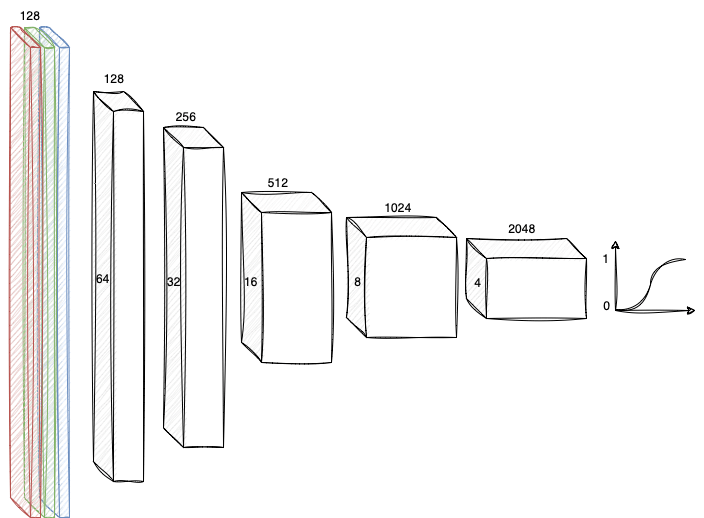
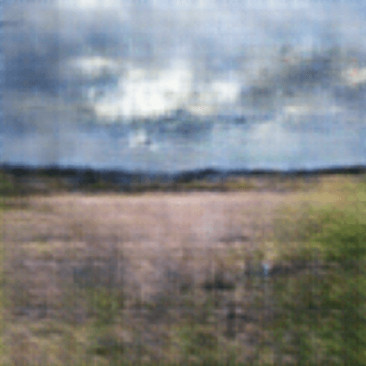
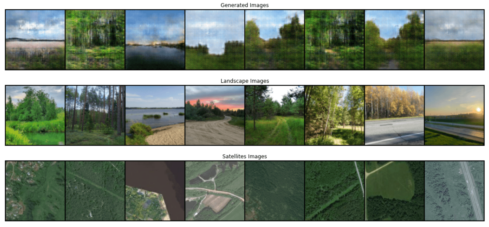
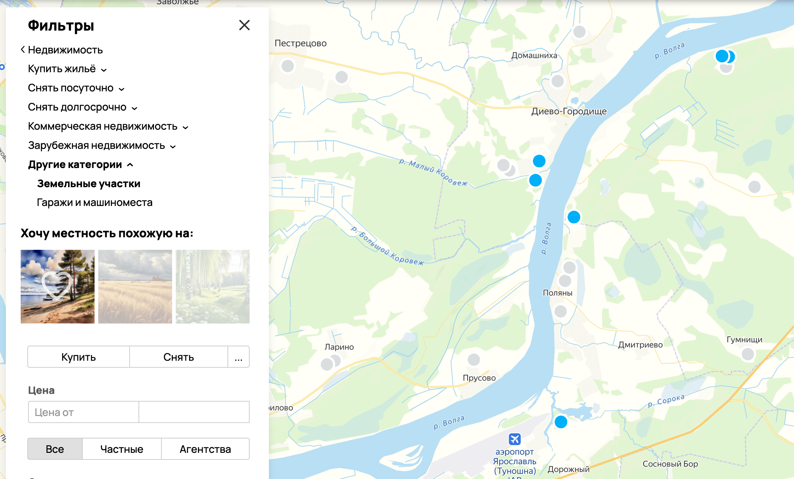

# Генерация изображений окружающего пространства по спутниковым снимкам

В общем виде задача, решаемая в работе, звучит так: «интерпретировать спутниковый снимок и предсказать что увидит наблюдатель, оказавшись в этой точке Земли».
В качестве исходной информации для генерации изображения окружающей среды выступает только спутниковый снимок (ну и, соответственно, веса обученных нейронных сетей).

На визуальном языке моделей машинного обучения искомое решение проблемы можно представить так:

<br/><div align="center" >
  
</div><br/>

В его основе две нейронных сети: энкодер и генератор.

1. Энкодер выделяет из спутникового изображения полезные признаки и отображает их в скрытое пространство низкой размерности
2. Генератор умеет создавать изображения-снимки местности, основываясь на входном состоянии — точке в скрытом пространстве

Вспомогательным звеном выступает дискриминатор, необходмый в процессе обучения генератора, но не используеющийся в последствии. 

## Условия и ограничения

Эта работа, как учебный проект, имеет ряд серьезных ограничений, как выявленных в процессе реализации, так и принятых в самом начале:

1. Генерируемые изображения имеют размер 128 на 128 пикселей
2. Фотографии, используемые для обучения генератора, содержат лишь несколько видов летнего ландшафта средней полосы
3. Энкодер обучается на участках спутниковых снимков размером 128 на 128 пикселей

Причиной таких ограничений явились два момента:

1. Ограниченность вычислительных ресурсов
2. Нетривиальность сбора данных для обучения

## Сбор и анализ данных

Для обучения нейронных сетей потребовалось два набора изображений:
 
1. Пейзажные фотографии с привязкой к географическим координатам места получения снимка
2. Спутниковые снимки поверхности Земли в соответствующих точках

Получить их позволяют публичные API Яндекс Карт и VK.

### Сбор пейзажных снимков

Для формирования датасета фотографий с геопривязками использовался API VK для доступа к общедоступным фотографиям. Кроме непосредственного скачивания фотографий потребовался многостадийный процесс их фильтрации, чтобы оставить ограниченный набор сцен для обучения генератора. В общем виде последовательный процесс получения итогового набора изображений следующий:

1. Получение списка публичных фотографий, загруженных пользователями
2. Отсеивание изображений, не имеющих привязки к географическим координатам
3. Фильтрация изображений согласно списку классов (используя нейросеть, предобученную на датасете Places365)
4. Фильтрация изображений, содержащих фигуры и лица людей (также используя предобученную стороннюю нейросеть)
5. Ручной отбор неподходящих снимков, пропущенных предыдущими фильтрами

В итоге из около полумиллиона загруженных фотографий были отобраны около 3000 фотографий для датасета. Это визуально приятные фотографии природы средней полосы России (Московская и Ярославская области) в теплое время года и при хорошей погоде днем. 

> В начале была предпринята попытка включить в набор даных также виды населенных пунктов, но процесс обучения генератора показал, что в этом случае фотографий должно быть значительно больше, для достижения мало-мальски воспринимаемого результата

Код описанного пути представлен в блокнотах [download_images.ipynb](./download_images.ipynb) и [filter_images.ipynb](./filter_images.ipynb).

### Сбор спутниковых снимков

Здесь задача оказалась значительно проще. Для географических координат каждой фотографии из пункта выше был получен спутниковый снимок с помощью Static API Яндекс Карт.

Код представлен в блокноте: [download_satellite_images.ipynb](./download_satellite_images.ipynb).

В итоге были получены два набора фотографий следующего вида:

<br/><div align="center" >
  
</div><br/>

## Реализация

Процесс обучения итоговой пары моделей можно разбить на два этапа:

1. Обучение генеративно-состязательной сети для создания фотографий из состояний скрытого пространства
2. Обучение сети энкодера, преобразующего призначи спутникового снимка в состояние скрытого пространства

Первый этап не зависит от второго, его итогом является модель-генератор, создающая изображния схожие представленным в датасете. На втором этапе, имея уже работающий генератор, энкодер обучается заставлять его генерировать пейзажи схожие исходным, в точках, где вторые были сняты.

<div align="center" >
  
</div><br/>

Далее подробно по каждому из этапов. 

### Архитектура и обучение генератора 

Так как набор сцен и состояний сильно ограничен, оказалось, что двузначная, а тем боле трехзначная, размерность скрытого пространства избыточна (сеть долго обучается и склонна к переобучению), поэтому было решено остановиться на 4-мерном векторе. Далее последовательное применение 5 слоев, использующих двумерные транспонированные свертки размером 4 на 4 с шагом 2. 

<div align="center" >
  
</div><br/>

На выходе получае цветное трехканальное квадратное изображение размером 128 на 128 пикселей. В силу того, вариантивность обучающих сцен достаточно небольшая, сеть обучалась с нуля, а не использовался fine tuning предобученного генератора.

Дискриминатор в свою очередь является практически зеркальным отражением генератора. Поступающее на вход изображение сквозь последовательные сверточные слои приводится к скалярной величине от 0 до 1, соответствующей вероятности того, что это изображение является сгенерированным нейросетью.


<div align="center" >
  
</div><br/>

В отличие от сети дискриминатора, который оставался достаточно точным при любом достигнутом числе итераций, генератор, по визуальной оценке, достигал максимального качества и начинал трансформировать уже, кажется, хорошо сформировавшиеся карты признаков. Поэтому шаг обучения генератора дополнительно корректировался шедулером StepLR, чтобы не промахваться мимо локальных минимумов. При использовавшихся шагах обучения, и наборе данных, своего потолка сеть достигает примерно на 800 эпохе.

Случайные примеры исходных фотографий и сгенерированных изображений приведены ниже.

<div align="center" >
  
</div></br>

Код представлен в блокноте: [gan.ipynb](./gan.ipynb).

### Архитектура и обучение энкодера

Как уже было сказано ранее, задача энкодера сводится к выделению на спутниковых снимках признаков, отображающихся в такие состояния скрытого пространства, из которых генератор создаст изображения, адекватные этой местности. Для спутникового снимка места, покрытого лесом, сгенерируется лесной пейзаж, для безлесой равнины — изображение поля и так далее.

На схеме выше приведена схема обучения энкодера. Поэтапно она выглядит так:

1. Энкодер получает на вход спутниковые снимки в координатах c<sub>1</sub>, c<sub>2</sub> ... c<sub>n</sub>
2. Последовательными сверками выделяются признаки и приводятся к вектору в скрытом пространстве
3. Генератор (уже обученный ранее) создает на основе этого вектора новые изображения
4. Эти изображения сравниваются с реальными, полученными в координатах c<sub>1</sub>, c<sub>2</sub> ... c<sub>n</sub>
5. Веса модели кооректируются, переходим к пункту 1

Архитектура энкодера достаточно схожа с дискриминатором, имеет столько же сверточных слоев с одинаковыми параметрами. Однако для энкодера выбраны вчетверо меньшие размеры карт признаков, так как вариативность спутниковых снимков, использованных в рамках задачи достаточно небольшая.

<div align="center" >
  
</div><br/>

Здесь основной сложностью является выбор корректной функции потерь, позволяющей понять насколько сгенерированное изображение отвечает тому, что мы видем на реальной фотографии этой местности. Об этом отдельно далее. 

#### Выбор функции потерь

В качестве функции потерь для сравнения изображений довольно часто используется среднеквадратичная ошибка яркости пикселей. Этот подход хорош, когда мы пытаемся достичь попиксельной схожести изображений, однако в данной работе задача сравнения изображений оказалась гораздо более специфичной. Для наглядности можно взглянуть на следующие примеры для сравнения:

<div align="center" >
  
</div><br/>

Здесь качественно каждые из пар верхнего и нижнего изображений достаточно далеки друг от друга. Однако по содержанию (а именно это и важно в задаче) очень близки. От функции потерь гораздо более важно показать именно то, насколько смысловое содержание сгенерированного и реального изображений схожи, нежели их качественная похожесть (оттенки, яркость, текстура). 

Немного расширить смысловую нагрузку MSE могла бы, на первый взгляд метрика SSIM, которая используется для оценки структурного сходства между двумя изображениями. В подходе SSIM сравниваются пространственные структуры двух изображений (отчасти это напоминает то, как работает человеческое зрение).

Для сравнения для изображений выше попарно были посчитаны значения функций потерь на основе MSE и SSIM. Результаты получились следующие:

| MSE Loss |  |  |  |
| - | :-: | :-: | :-: |
|  | **0.14** | 0.46 | 0.22 |
|  | 0.40 | 0.43 | **0.30** |
|  | 0.61 | 0.27 | **0.22** |

| SSIM Loss |  |  |  |
| - | :-: | :-: | :-: |
|  | **0.84** | 0.96 | 0.96 |
|  | **0.90** | **0.90** | 0.94 |
|  | 1.05 | **0.89** | 0.92 |

Код SSIM, использовавшийся в сравнении, представлен в файле: [gan.ipynb](./ssim.py).

Идеальная для данной задачи функция должна вернуть минимальные значения для схожих пар. Эти значения расположились на главной диагонали матрицы. Однако ни MSE, ни SSIM не отвечают этому в достаточной степени. Поэтому в задаче использовалась специальная функция потерь, основанная на предобученной модели классификатора, использовавшегося при формировании датасета. Схема проста:

1. Получаем поклассовые вероятности для первого изображения
2. Получаем поклассовые вероятности для второго изображения
3. Считаем MSE loss для этих двух тензоров.

Результаты превзошли предыдущие два подхода:

| Custom<br/> Loss |  |  |  |
| - | :-: | :-: | :-: |
|  | **3.40** | 4.23 | 4.37 |
|  | 6.79 | **4.08** | 4.61 |
|  | 5.67 | 3.16 | **2.66** |

Отдельной сложностью здесь явилось то, что на самых первых эпохах связка энкодер-генератор имела свойство сваливаться к краям скрытого пространства, откуда в последствии выбраться не удавалось. Поэтому была введена поправка на степень близости полученной выборки состояний в пределах батча к нормальному распределению (по аналогии с расстоянием Кульбака — Лейблера). Эта мера адекватна при достаточно больших размеров батчей, так как при обучении генератора использовался шум с нормальным распределением.

Код примененной функции потерь выглядит следующим образом, где MSE_CLASS — часть, отвечающая за «правильность» содержания сгенерированного изображения, а MSE_NORM — за «нормальность» полученного распределения. 

```python
def class_norm_criterion(tensor1, tensor2, mean, variance):
    logit1 = model.forward(tensor1)
    logit2 = model.forward(tensor2)

    MSE_CLASS = nn.MSELoss()(logit1, logit2)
    MSE_NORM = mean.pow(2) + (1 - variance).pow(2)

    return MSE_CLASS + MSE_NORM * 0.5
```

Полный код обучения энкодера представлен в блокноте: [gan.ipynb](./encoder.ipynb).

## Демонстрация

По результатам работы связка энкодер-генератор была обучена создавать изображения, минимально адекватно описывающие то, что открывается взору наблюдателя в местности, запечатленной спутником.

<div align="center" >
  
</div><br/>

Небольшое клиент-серверное приложение позволяет повзаимодействовать с моделями интерактивно.

<div align="center" >
  
</div><br/>

Демонстрационное приложение находится в папке: [demo](./demo).

## Практическая значимость

Полученная система может применяться в массе случаев, когда требуется визуальное подкрепление, а единственной актуальной и достоверной информацией о местности служит спутниковый снимок. Ниже приведены несколько возможных путей использования разработки.

1. Валидация загружаемых пользователями фотографий

   Зачастую, в картографических сервисах (живой пример - Яндекс Карты) попадаются объекты, например фотографии или панорамы, с ошибочной геопривязкой. Проверить корректность загружаемой фотографии заявленной точке на карте - подходящая задача для этой системы.
<div align="center" >
    
</div><br/>
2. Визуальная фильтрация по типу местности
   
   Пример - фильтр для выбора максимально подходящей местности на карте для сервиса недвижимости. 
<br/><br/><div align="center" >
    
</div><br/>
3. Генерация контента
   
   Для природных объектов на карте, не снабженных пользовательскими фотографиями. 
<br/><br/><div align="center" >
    
</div><br/>
   
## Выводы

