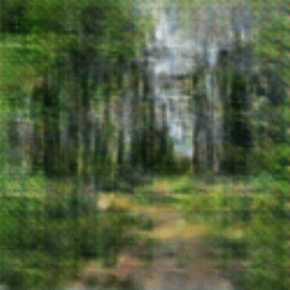

# Генерация изображений окружающего пространства по спутниковым снимкам

В общем виде задача, решаемая в работе, звучит так: «интерпретировать спутниковый снимок и предсказать что увидит наблюдатель, оказавшись в этой точке Земли».
В качестве исходной информации для генерации изображения окружающей среды выступает только спутниковый снимок (ну и, соответственно, веса обученных нейронных сетей).

На визуальном языке моделей машинного обучения искомое решение проблемы можно представить так:

В его основе две нейронных сети: энкодер и генератор.

1. Энкодер выделяет из спутникового изображения полезные признаки и отображает их в скрытое пространство низкой размерности
2. Генератор умеет создавать изображения-снимки местности, основываясь на входном состоянии — точке в скрытом пространстве

Вспомогательным звеном выступает дискриминатор, необходмый в процессе обучения генератора, но не используеющийся в последствии. 

## Условия и ограничения

Эта работа, как учебный проект, имеет ряд серьезных ограничений, как выявленных в процессе реализации, так и принятых в самом начале:

1. Генерируемые изображения имеют размер 128 на 128 пикселей
2. Фотографии, используемые для обучения генератора, содержат лишь несколько видов летнего ландшафта средней полосы
3. Энкодер обучается на участках спутниковых снимков размером 128 на 128 пикселей

Причиной таких ограничений явились два момента:

1. Ограниченность вычислительных ресурсов
2. Нетривиальность сбора данных для обучения

## Сбор и анализ данных

Для обучения нейронных сетей потребовалось два набора изображений:
 
1. Пейзажные фотографии с привязкой к географическим координатам места получения снимка
2. Спутниковые снимки поверхности Земли в соответствующих точках

Получить их позволяют публичные API Яндекс Карт и VK.

### Сбор пейзажных снимков

Для формирования датасета фотографий с геопривязками использовался API VK для доступа к общедоступным фотографиям. Кроме непосредственного скачивания фотографий потребовался многостадийный процесс их фильтрации, чтобы оставить ограниченный набор сцен для обучения генератора. В общем виде последовательный процесс получения итогового набора изображений следующий:

1. Получение списка публичных фотографий, загруженных пользователями
2. Отсеивание изображений, не имеющих привязки к географическим координатам
3. Фильтрация изображений согласно списку классов (используя нейросеть, предобученную на датасете Places365)
4. Фильтрация изображений, содержащих фигуры и лица людей (также используя предобученную стороннюю нейросеть)
5. Ручной отбор неподходящих снимков, пропущенных предыдущими фильтрами

В итоге из около полумиллиона загруженных фотографий были отобраны около 3000 фотографий для датасета. Это визуально приятные фотографии природы средней полосы России (Московская и Ярославская области) в теплое время года и при хорошей погоде днем. 

> В начале была предпринята попытка включить в набор даных также виды населенных пунктов, но процесс обучения генератора показал, что в этом случае фотографий должно быть значительно больше, для достижения мало-мальски воспринимаемого результата

Код описанного пути представлен в блокнотах [download_images.ipynb](./download_images.ipynb) и [filter_images.ipynb](./filter_images.ipynb).

### Сбор спутниковых снимков

Здесь задача оказалась значительно проще. Для географических координат каждой фотографии из пункта выше был получен спутниковый снимок с помощью Static API Яндекс Карт.

Код представлен в блокноте: [download_satellite_images.ipynb](./download_satellite_images.ipynb).

В итоге были получены два набора фотографий следующего вида:

## Реализация

Процесс обучения итоговой пары моделей можно разбить на два этапа:

1. Обучение генеративно-состязательной сети для создания фотографий из состояний скрытого пространства
2. Обучение сети энкодера, преобразующего призначи спутникового снимка в состояние скрытого пространства

Первый этап не зависит от второго, его итогом является модель-генератор, создающая изображния схожие представленным в датасете. На втором этапе, имея уже работающий генератор, энкодер обучается заставлять его генерировать пейзажи схожие исходным, в точках, где вторые были сняты.

Далее подробно по каждому из этапов. 

### Архитектура и обучение генератора 

Так как набор сцен и состояний сильно ограничен, оказалось, что двузначная, а тем боле трехзначная, размерность скрытого пространства избыточна (сеть долго обучается и склонна к переобученю), поэтому было решено остановиться на 4-мерном векторе. Далее последовательным применение 5 слоев, использующих двумерные транспонированные свертки размером 4 на 4 с шагом 2. 

На выходе получае цветное трехканальное квадратное изображение размером 128 на 128 пикселей. В силу того, вариантивность обучающих сцен достаточно небольшая, сеть обучалась с нуля, а не использовался fine tuning предобученного генератора.

Дискриминатор в свою очередь является практически зеркальным отражением генератора. Поступающее на вход изображение сквозь последовательные сверточные слои приводится к скалярной величине от 0 до 1, соответствующей вероятности того, что это изображение является сгенерированным нейросетью.

Код представлен в блокноте: [gan.ipynb](./gan.ipynb).

### Архитектура и обучение энкодера

| MSE Loss |  |  |  |
| - | :-: | :-: | :-: |
|  | **0.14** | 0.46 | 0.22 |
|  | 0.40 | **0.43** | 0.30 |
|  | 0.61 | 0.27 | **0.22** |

## Результаты

